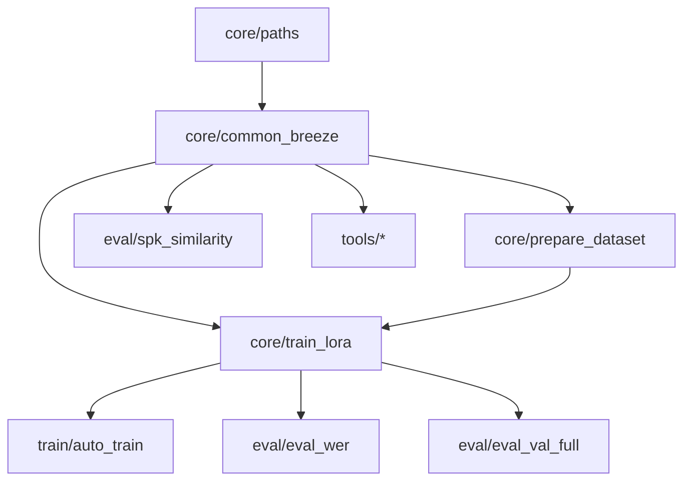

# `ptbr_lora/` — codigo autoral do projeto (LoRA PT-BR do Breeze TTS 2)

Este diretorio reune **todo o codigo escrito por nos** dentro do fork. O engine
oficial (`breeze_infer/`, `models/`, `infer.py`) fica na raiz do repositorio e
**nao foi alterado**; os pesos e artefatos ficam **fora** do git.

> Entrada do repositorio: `../PTBR_LORA.md`.
> Documentacao publica: `../docs/` (instalacao, configuracao, dados, treino, avaliacao).
> Caminhos/ambiente: `core/paths.py` + `.env` (ver `../.env.example`).

## Mapa dos modulos

```
ptbr_lora/
├─ core/     paths.py, common_breeze.py, prepare_dataset.py, train_lora.py
├─ data/     download_datasets.py, build_corpus.py, tagarela_speakers.py
├─ scraping/ pipeline de podcast (00..05, api_check)
├─ train/    auto_train.py
├─ eval/     eval_val_full.py, eval_wer.py, spk_similarity.py
└─ tools/    analyze_model.py, smoke_forward_b.py, scan_alvos.py, analise_acentos.py
```

## Dependencias entre modulos



Todos os scripts adicionam `ptbr_lora/core/` ao `sys.path` automaticamente.
O engine e importado da raiz do fork (`paths.BREEZE_REPO`).

## Ambiente

```powershell
$py = "<caminho-do-venv>\Scripts\python.exe"
$env:PTBR_ARTIFACTS = "C:\IA\Breeze-tts"   # ou defina no .env da raiz
```

Os caminhos absolutos antigos (`C:\IA\Breeze-tts\...`) foram removidos; ajuste
apenas `PTBR_ARTIFACTS`. Detalhes em `../docs/CONFIGURATION.md`.
